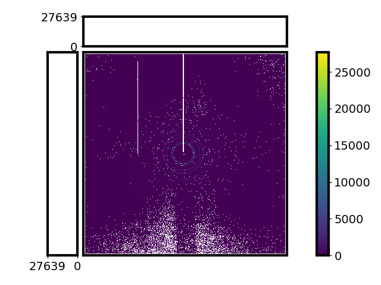
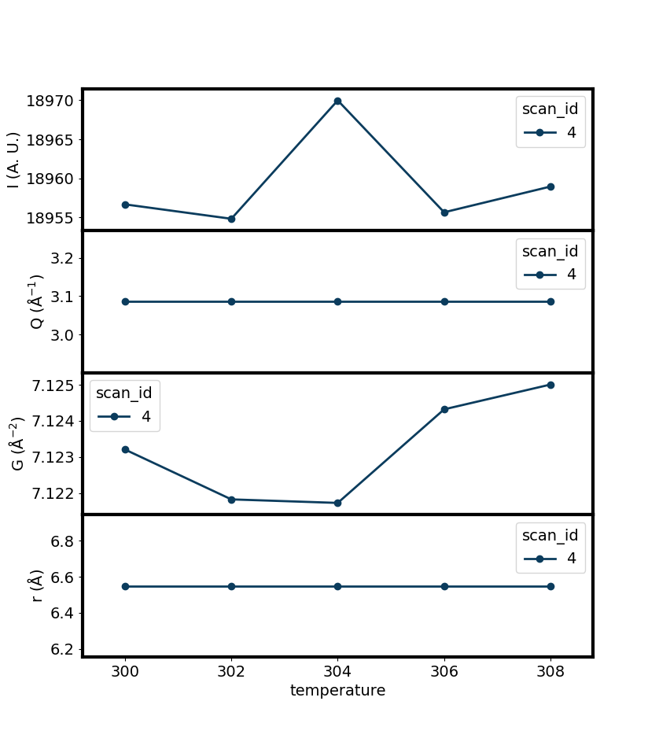

XPD Server
==========

The XPD Server is a server designed for x-ray powder diffraction experiments. It will process image data from
a two dimensional detector.

What does XPD Server do?
------------------------

The XPD Server receives the message from a proxy. Depending on what type of the data is in the message, the server
will apply different data processing method to it.

Calibration
^^^^^^^^^^^

If the XPD Server finds that the data is intended to be used to calibrate the sample detector distances along with
other experiment setup in the system, it will start the calibration process as followings:

#. Find the dark frame image in the database.

#. Subtract the light frame image in the message by the dark frame image and get the dark subtracted image.

#. Ask users to draw mask on the image.

#. Ask users to select several points on the inner Debye-Scherrer rings to allocate their positions.

#. Fit the ring positions to optimize the experiment setup geometry parameters including samples detector distance and detector frame orientation.

#. Use the parameters to do azimuthal integration on the image to get the integration results.

#. Ask users to check the results and save it in a poni file at the designated place.

Data Reduction
^^^^^^^^^^^^^^

If the XPD Server finds that the data is a light frame diffraction image of a sample, it will start the data
reduction process as followings:

#. Find the dark frame image in the database.

#. Find the background light frame image and its dark frame image in the database.

#. Do dark subtraction on the background image.

#. Do dark subtraction on the sample image.

#. Subtract the sample image by the background image.

#. Mask the bad pixels in the image.

#. Do azimuthal integration on the image to get the x-ray diffraction pattern (XRD) on momentum transfer grid.

#. Transfer the XRD pattern to the reduced pair distribution function (PDF).

#. (Optional) Dump the processed data with the independent variables (e. g. temperature) in the database.

#. (Optional) Export the processed images in tiff files.

#. (Optional) Export the reduced data in numpy files.

#. (Optional) Export the scalar data in the measurement in csv files.

#. (Optional) Export metadata in json files.

#. (Optional) Visualize the images in a window.

#. (Optional) Visualize the waterfall plot of the reduced data in a window.

#. (Optional) Visualize the scalar plot of the maximum peak height and peak position of the maximum peak in the XRD and PDF.

Dark frame
^^^^^^^^^^

If the XPD Server finds that the data is a dark frame image, it will ignore the data and do nothing. It assumes
that the data frame image has been already record in the database in another process.

How to setup a XPD Server?
--------------------------

There are only two steps: first, write a configuration file or download one; start a server in terminal using
that file.

Write the configuration file
^^^^^^^^^^^^^^^^^^^^^^^^^^^^

The server needs a .ini file. This file contains all the configuration to build a server. An example of the file
is shown below. Please read the comments in the file to know what are the meaning of the parameters.

.. include:: ../_static/xpd_server.ini
   :literal:

The parameters you can change are the values that behind the equity symbol in each row. Usually, you don't need
to change the file structure but if you would like to do that, you can find what file structure is supported
`here <https://docs.python.org/3/library/configparser.html#supported-ini-file-structure>`_.

Start the server
^^^^^^^^^^^^^^^^

Assume that you have written a configuration file and the path to it is "~/xpd_server.ini".

In terminal, run the command::

    run_server xpd ~/xpd_server.ini

The server will start in terminal.

If you would like to terminate the server, press ``CTRL + C``.

(Recommended) Put the configuration file in default folder
^^^^^^^^^^^^^^^^^^^^^^^^^^^^^^^^^^^^^^^^^^^^^^^^^^^^^^^^^^

If you are tired of typing the path to the configuration file, you can put the .ini file in the default folder,
the software will find the configuration file for the server according to the name parameter in the
configuration file.

To know where the default configuration folder is, run the command::

    print_server_config_dir

You will find the path to the directory. Put the .ini file in that directory and then you can just run::

    run_server xpd

The server will start.

(Optional) Run the server in a detached background process
^^^^^^^^^^^^^^^^^^^^^^^^^^^^^^^^^^^^^^^^^^^^^^^^^^^^^^^^^^

Similar to what you have done with the proxy, you can also run the server in background and detach it from the
terminal so that you don't need to start the server every time. To do this, in terminal, run command::

    nohup run_server xpd ~/xpd_server.ini &

If you have put the "xpd_server.ini" in default folder, run this instead::

    nohup run_server xpd &

You will find the message from the server in file "nohup.out".

If you would like to terminate the background process, in terminal, run command::

    kill <job ID>

The ``<job ID>`` is a number that shows up after you run the command ``nohup run_server xpd &``.

How to do the calibration?
--------------------------

When you run the ``run_calibration()`` in ``bsui`` of xpdacq, the xpd server responds and gives you a window of
diffraction image. You will finish the calibration using that interface . Please see the
`tutorials <https://pyfai.readthedocs.io/en/master/usage/cookbook/calib-gui/index.html>`_ to learn
how to use it. When you are at the last step of the tutorials and you are going to save the geometry in a PONI
file, please save the file at exact where it is first shown in the finder window after you click the
"SAVE AS PONI" button.

How to do the data reduction?
-----------------------------

The data reduction is totally automatic after you start the server and finish your calibration run. The server
will process the streaming data by itself according to the configuration. You will find messages in the terminal
where the server is running. It tells you if a data processing starts or finishes and if there are any errors.

How to get the data back home?
------------------------------

The processed data will be archived in the database specified in the .ini file of the server, if you are
familar with the `databroker <https://blueskyproject.io/databroker/>`_, you can find the catalog name in the
.ini file of the server.

The processed data will also be exported to the files in the folder specified in .ini file. The diffraction
image data together with the mask data will be saved in .tiff files. The scalar data like temperature and motor
positions will be in the .csv files. You can match the scalar data with the image by the start id and the
sequence number. The reduced data like XRD and PDF will be in the .npy files.
You can use `numpy <https://numpy.org/devdocs/user/quickstart.html>`_
to open it and transfer it to other format you like. The metadata like the sample information, wavelength of the
beam, and the experiment setup can be found in the .json files.

How to see the data during the experiment?
------------------------------------------

The data will be visualized in windows. The windows will pop up when you start the server and the plot will
automatically show up when you are running the experiments using xpdacq.

The images will be plotted in a two dimensional colorful histogram, you can move the cursor onto one point and
the pixel values in horizontal and vertical line across the point will be shown in the panels around the image.
Below is an example of the masked dark subtracted diffraction image.

The reduced data like XRD and PDF will be plotted in a waterfall plot, you can change the x-offset and y-offset
to move the curves in two dimensions. Below is an example of the waterfall plot of PDF.

.. figure:: ../_static/gr.png

The scalar data like the maximum points will be plotted in a line plot. The x-axis will be the independent
variable in the measurement. In the example below, the coordinates of maximum point in XRD and PDF are plotted
as a function of temperature.

